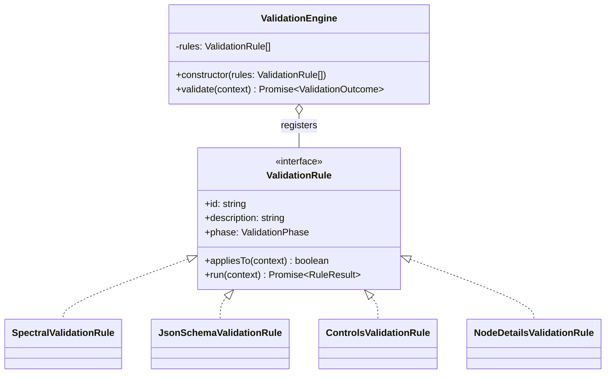
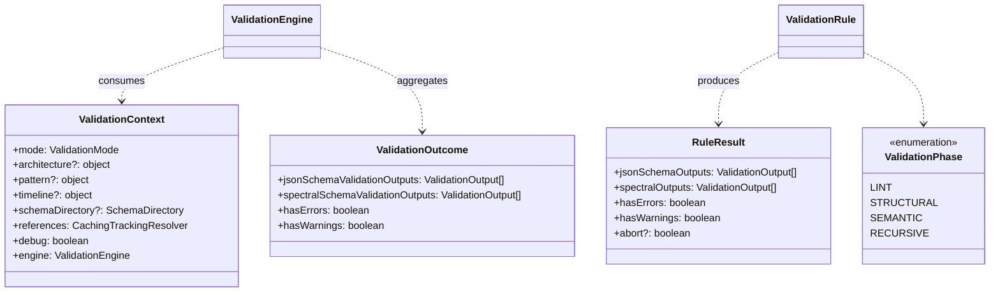
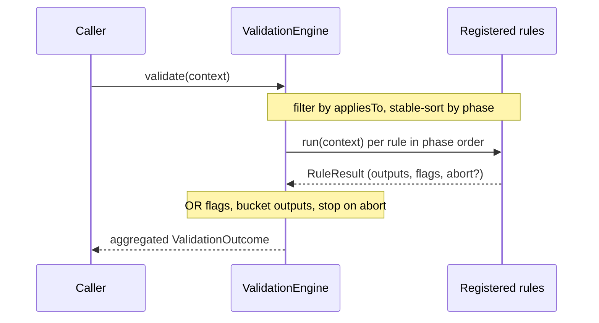
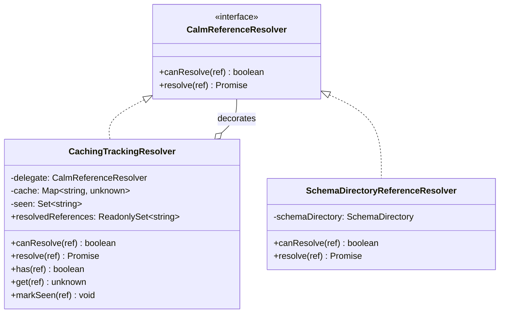
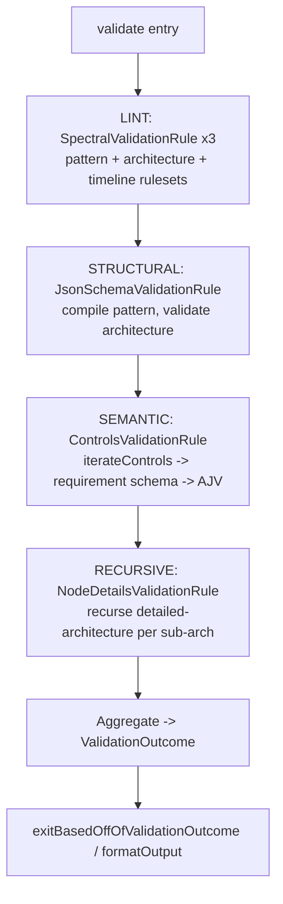

# Validation Technical Specification

Technical design for CALM document validation in `shared` (`@finos/calm-models` model +
`shared/src/commands/validate`). Validation is a phased pipeline built from **`ValidationRule`**
units executed by a **`ValidationEngine`**. `validate(...)` builds a `ValidationContext` and calls
`ValidationEngine.validate`, which runs the registered rules and aggregates their results into a
single `ValidationOutcome`. Rules come in two families over a shared context: Spectral-backed
(JSONPath over raw JSON) and model/schema-backed (AJV / typed `CalmCore`). Recursive resolution of a
node's `detailed-architecture` is opt-in and resolver-controlled: it is governed by a reference
resolution policy that defaults to shallow, so top-level validation never implicitly fetches
sub-architectures.

## 1. Objectives

- **O1: One authoritative validator in `shared`.** Validation is a library concern, not a CLI
  concern. The CLI, CALM Hub (upload), CalmStudio, and any future tool call the same
  `validate(...)` entry point so guarantees cannot be bypassed by hitting an API directly.
- **O2: Phased validation.** Run cheap/broad linting (Spectral) and structural schema validation
  (JSON Schema) as distinct phases, plus semantic/model checks (controls, node-details recursion).
  A failure in one phase still lets other phases report, so users get a complete picture.
- **O3: Uniform, machine-readable output.** Every phase emits `ValidationOutput` items aggregated
  into a single `ValidationOutcome` with stable `code`, `severity`, JSON-pointer `path`, and
  `source`. Downstream (JUnit/JSON/pretty formatters, Hub UI) depends on this shape.
- **O4: Cycle- and reference-safe traversal.** Detailed architectures and control configs are
  references that can form cycles; traversal must terminate and must not re-fetch or re-adapt more
  than necessary.
- **O5: Extensibility.** Adding a new check is registering a new `ValidationRule` with the engine;
  the entry point does not change.
- **O6: Opt-in deep resolution.** Deep (recursive) validation of referenced sub-architectures is a
  caller-selected policy, off by default. A shallow validation checks only the supplied document; a
  caller such as CalmHub opts in to deep validation when it wants sub-architectures resolved and
  validated too.

## 2. Assumptions

- **A1: Downstream expects the current `ValidationOutcome` contract.** `hasErrors`/`hasWarnings`
  drive process exit codes (`exitBasedOffOfValidationOutcome`); formatters read `jsonSchema*` and
  `spectral*` output arrays and each `ValidationOutput` field. Behaviour-preservation applies to this
  external output *shape*; it does not mandate always-on recursion, which is policy-controlled (O6).
- **A2: `SchemaDirectory` is the single resolution boundary.** All remote/relative document and
  schema loading goes through `SchemaDirectory` (backed by a `DocumentLoader`). Validators never
  fetch directly.
- **A3: The model owns references.** `Resolvable`/`ResolvableAndAdaptable` (calm-models) are the
  canonical representation of a `$ref`-like pointer. Raw documents are transient; only adapted model
  objects persist.
- **A4: Spectral operates on raw JSON; model checks operate on the typed model.** Spectral rules
  use JSONPath (`given`/`then`) over the stringified document. Model checks (controls, node-details)
  operate on `CalmCore`. These are two distinct substrates.
- **A5: A pattern may be an explicit CALM pattern or the CALM core schema.** The entry point
  honours the architecture's `$schema` or an explicitly supplied pattern.
- **A6: Validation is read-only and side-effect-free** apart from logging and cache population in
  `SchemaDirectory`.
- **A7: References are resolved lazily, only when necessary.** The calm-model `Resolvable` /
  `CalmReferenceResolver.canResolve` seam means a reference is fetched only when a caller chooses to
  dereference it. "When necessary" is therefore a policy decision: the resolution policy decides
  which references (for example `detailed-architecture` documents) are resolvable in a given run.

## 3. Architecture: `ValidationRule` + `ValidationEngine`

`ValidationRule` is the unit of validation. Each rule declares an `id`, a `phase`
(`ValidationPhase`), an `appliesTo(context)` predicate (usually a `mode` check), and a
`run(context)` that returns a `RuleResult`. `ValidationEngine` is constructed with the list of rules;
on `validate(context)` it:

1. filters rules by `appliesTo(context)`;
2. runs the survivors in ascending `phase` order (stable; registration order is preserved within a
   phase);
3. aggregates each `RuleResult` into a single `ValidationOutcome`, pushing `jsonSchemaOutputs` and
   `spectralOutputs` into their respective buckets and OR-ing `hasErrors` / `hasWarnings`;
4. stops early if a rule sets `RuleResult.abort`.



## 4. Context and result types

`ValidationContext` is the single input passed to every rule; `RuleResult` is the per-rule output;
`ValidationOutcome` is the aggregated external contract (A1).



## 5. Rules

Rules fall into two families; all implement the same `ValidationRule` interface (no shared base
class).

- **Spectral-backed**: `SpectralValidationRule` adapts a Spectral `RulesetDefinition` (raw-JSON /
  JSONPath rules). Three are registered: `spectral-pattern`, `spectral-architecture`,
  `spectral-timeline`. Custom checks such as `idsAreUnique`, `nodeIdExists`,
  `interfaceIdExistsOnNode`, `sequenceNumbersAreUnique` are Spectral custom functions over JSONPath.
- **Model/schema-backed**: reason over the parsed `CalmCore` model or an AJV schema:
  `JsonSchemaValidationRule` (STRUCTURAL, AJV), `ControlsValidationRule` (SEMANTIC, via
  `iterateControls`), and `NodeDetailsValidationRule` (RECURSIVE, node iteration). Node-details
  tracks visited references through the `CachingTrackingResolver` on the context. `ModelWalker` is
  the shared cycle-safe traversal available to model-backed rules.

`NodeDetailsValidationRule.run` builds a child `ValidationContext` (a forked `SchemaDirectory` for
AJV schema-id isolation, plus the shared `CachingTrackingResolver`) and calls `engine.validate`
again for each detailed sub-architecture; the resolver's visited-reference tracking guarantees each
sub-architecture is validated once and terminates on cycles.



## 6. Reference resolution, caching and cycle safety

The CALM model is *lazily* dereferenced: a `ResolvableAndAdaptable<CalmCoreSchema, CalmCore>`
only calls `resolve(ref)` when a caller chooses to dereference it, and the resolve function returns
the **raw** `CalmCoreSchema` before it is adapted to `CalmCore`. Node-details validation needs that
raw document (for Spectral + JSON-Schema), so the resolve seam is the natural place to centralise:

- **caching**: a reference is fetched at most once; repeat requests return the cached raw document;
- **tracking**: every attempted reference is recorded, giving dedupe ("validate each
  detailed-architecture once") and cycle safety without each caller keeping its own `Set`.

`CachingTrackingResolver` is a **decorator** that `implements CalmReferenceResolver`, wrapping any
inner resolver. This is the single resolver interface used by both the model dereference path and
validation:



A reference is marked *seen* before the underlying load is awaited, so a failed load still counts as
seen (a sibling referencing the same failing URL is not retried), matching the
`visitedUrls.add`-before-load behaviour originally implemented in PR #2778
(https://github.com/finos/architecture-as-code/pull/2778). Only successful loads populate the value
cache. In
validation the decorator wraps a `SchemaDirectoryReferenceResolver` (which loads architecture
documents via `schemaDirectory.loadDocument(ref, 'architecture')`); in docify the **caller**
(`TemplateProcessor`) composes the decorator around its resolver (`Mapped` → `Composite`) so repeated
references are fetched once. Both `DereferencingVisitor` and `ModelWalker` are agnostic: they
dereference through whatever `CalmReferenceResolver` they are given; caching/tracking is purely the
caller's composition choice.

### Resolution policy (design intent)

Whether a given reference is resolvable is governed by a `ReferenceResolutionPolicy`, consulted in
`canResolve`. The policy is a constructor input to the resolver adapter; the `CalmReferenceResolver`
interface is unchanged. Two variants:

- **shallow (default):** `canResolve` returns `false` for `detailed-architecture` document
  references, so a shallow run never fetches or recurses into sub-architectures.
- **deep (opt-in):** `canResolve` allows those references, so the node-details rule resolves and
  validates each referenced sub-architecture (see §7).

Because only the node-details rule uses `ValidationContext.references` (schemas load via
`SchemaDirectory.getSchema` directly), the policy affects recursion alone. Child validation contexts
reuse the same resolver, so the policy is inherited at every level of recursion. This is design
intent; the policy type, its resolver wiring and the entry-point option are pending implementation.

## 7. Phased validation

For an architecture-against-pattern validation the phases are:



- **LINT: Spectral (`SpectralValidationRule`).** Runs the `rules-pattern`, `rules-architecture`
  and `rules-timeline` rulesets. Custom checks such as `idsAreUnique`, `nodeIdExists`,
  `interfaceIdExistsOnNode`, `sequenceNumbersAreUnique` are Spectral custom functions over JSONPath.
- **STRUCTURAL: JSON Schema (`JsonSchemaValidationRule`).** Compiles the pattern/core schema with
  AJV (async schema loading via `SchemaDirectory`) and validates the architecture.
- **SEMANTIC: Controls (`ControlsValidationRule`).** Enumerates controls via `iterateControls`,
  resolves each requirement schema (URL or `#`-pointer into the pattern) and validates the control
  config against it with AJV.
- **RECURSIVE: Node details (`NodeDetailsValidationRule`).** For every node that carries a
  `details.detailed-architecture` reference *that the resolution policy permits* (deep runs only; see
  §6), loads that sub-architecture document through the shared `CachingTrackingResolver`, discovers
  its pattern (`required-pattern` URL, else the document's `$schema`, else none) and re-enters the
  whole engine on the sub-architecture, with mode `architecture-with-pattern` or `architecture-only`
  depending on whether a pattern was found. Because re-entry runs every applicable phase, including
  this one, the traversal is depth-first: a sub-architecture whose own nodes reference further
  detailed-architectures recurses again. The shared resolver guarantees each referenced document is
  validated at most once and that cycles terminate (an already-seen reference is skipped). Under the
  shallow (default) policy no sub-architecture is resolvable, so the rule finds nothing to recurse
  into and only the supplied document is validated; a reference the policy forbids is skipped
  cleanly and does not produce an error.

The SEMANTIC and RECURSIVE rules only apply when a `SchemaDirectory` is available.

### Aggregated outcome

Every phase, at every resolved depth, contributes to a single flat `ValidationOutcome`. There is no
nested result tree: findings from recursed sub-architectures are merged into the same two arrays as
the top-level findings (`jsonSchemaValidationOutputs`, `spectralSchemaValidationOutputs`), and
`hasErrors`/`hasWarnings` are OR-ed across all of them. Under a shallow run the outcome contains the
top-level findings only. Depth is preserved only in each output's `path`, which is prefixed with the
referencing node's `/nodes/{i}/details/detailed-architecture` at each level of recursion. So a
JSON-Schema error two levels deep appears in the top-level outcome with a compound path such as:

```text
/nodes/0/details/detailed-architecture/nodes/2/details/detailed-architecture/relationships/1
```

A sub-architecture reference the policy permits but that cannot be loaded or validated is reported as
a single `node-details-validation` error at the referencing node's
`/nodes/{i}/details/detailed-architecture` path. A reference the policy forbids is not an error.

### Callers and CalmHub

The resolution policy is chosen by the caller. The CLI defaults to deep (with a shallow opt-out flag)
to preserve its existing behaviour, while the calm-server route and CalmHub default to shallow and
opt in to deep when a recursive validation is wanted. CalmHub is the primary driver of deep runs,
resolving and validating sub-architectures on demand. The caller wiring is design intent and pending
implementation.

## 8. Open questions and future direction

The following are known gaps and directions the current design does not yet cover. They are recorded
as design intent, not settled behaviour.

- **Default traversal and resolution policies.** By default, validation recurses into a node's
  `detailed-architecture`. This rewrite still suffers from the same concern raised on
  https://github.com/finos/architecture-as-code/pull/2778: the traversal is effectively always-on.
  Making it configurable through a resolution policy, rather than always-on, is worth considering so
  callers can decide when a deep run happens. The mechanism is left open here.
- **Custom rules versus the default traversal.** Custom or organisation-specific rules may apply only
  to specific documents or specific document types, which the generic default traversal does not
  model. It is an open question how a caller such as CalmHub tells the calm-server which
  organisation-specific rules to run, and how differing rule sets across a large organisation are
  catered for. See
  https://github.com/finos/architecture-as-code/issues/2716#issuecomment-4868731836 and issue #2566.
- **Typed CALM document input.** `validate()` currently accepts four loosely-typed positional inputs
  (`architecture`, `patternOrSchema`, `timeline`, `schemaDirectory`) and infers a mode from their
  combination. A future direction is to accept a single typed CALM document from `calm-models` instead,
  standardising the document type in one place. See issue #2770.
- **CLI versus CalmHub.** Validation may work differently depending on the caller. The CLI is
  user-driven and would default to recursive (deep) traversal to preserve its existing behaviour,
  whereas CalmHub validates documents on upload and would decide when a deep validation is performed,
  for example defaulting to a shallow run and opting in to a deep run only when needed.
